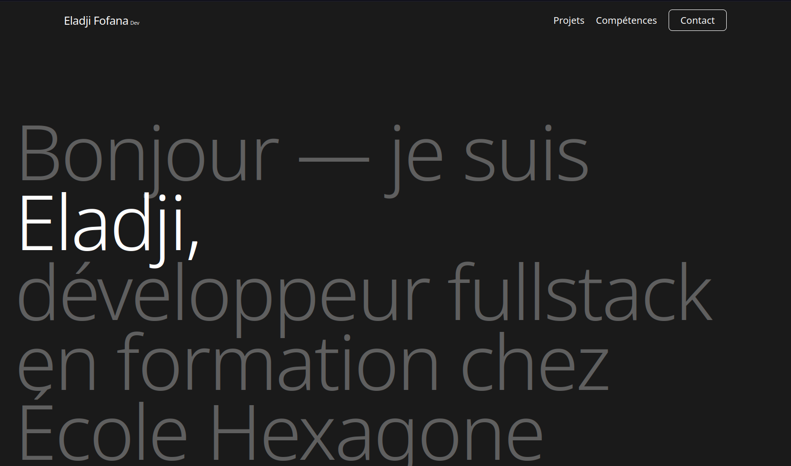
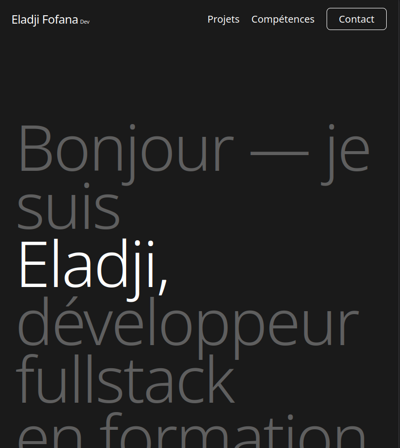
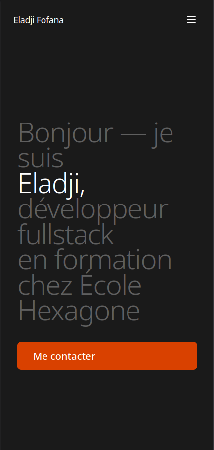
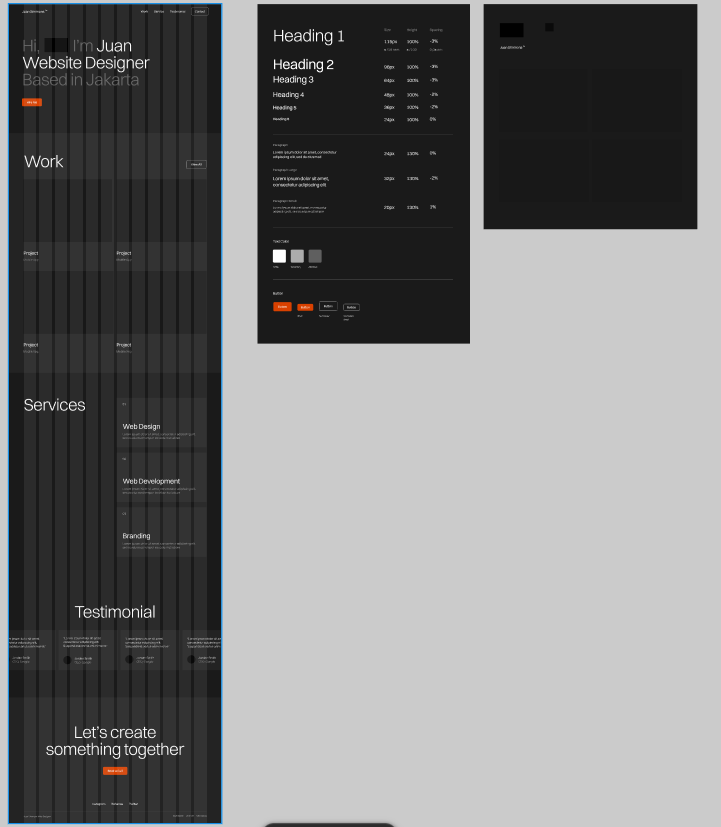

# Portfolio - Intégration

**Nom :** Eladji Fofana  
**Formation :** Bachelor Informatique - École Hexagone Versailles

## Aperçu
Ce dépôt contient l'intégration HTML/CSS/Tailwind d'une maquette Figma de portfolio.

- Page principale : [index.html](index.html)

### Capture d'écran
Ajoutez ici vos captures d'écran (desktop, tablette, mobile) dans le dossier `assets/` puis insérez les images ci-dessous :

- Aperçu desktop : 
- Aperçu tablet  : 
- Aperçu mobile  : 

(Option : vous pouvez générer des captures avec votre navigateur et les déposer dans `assets/`. )

---

## Maquette Figma utilisée
Lien de la maquette choisie :
https://www.figma.com/design/NMM4HyjAW9aDayZmnTdWre/Juan-Simmons---Portfolio-Website--Community-?node-id=78-874&m=dev


## Résultat LightHouse
[link](https://lighthouse-metrics.com/lighthouse/checks/17ff9c4e-02a6-4460-a43d-95cb15263ba3)
---

## Langages & outils
- HTML5
- CSS3
- Tailwind CSS (build local via Tailwind CLI + PostCSS)
- JavaScript (vanilla) pour validations et rendu dynamique

**Notes importantes :**
- Le projet utilise désormais un build local Tailwind (`npm run build:css`) pour produire `public/styles.css`. Cela garantit un contrôle reproductible lors des déploiements (Vercel installe les dépendances et exécute la commande `npm run build`).
- Les contenus (À propos, Projets, Compétences) sont dynamiques et proviennent de `public/data.json`. Éditez ce fichier pour mettre à jour la page sans toucher au HTML.

---

## Structure du dépôt
```
.
├── index.html              # Page principale
├── api/
│   └── contact.js          # Endpoint serverless pour formulaire contact
├── public/                 # Dossier pour les images, assets et build statique
│   ├── styles.css          # CSS généré par Tailwind
│   ├── data.json           # Contenu dynamique (À propos, Projets, Compétences)
│   └── js/                 # Scripts client (content.js, ui.js)
├── src/                    # Sources (tailwind input)
│   └── input.css
├── tailwind.config.cjs     # Config Tailwind
├── postcss.config.cjs      # Config PostCSS
├── package.json            # Scripts et dépendances (tailwind build)
├── vercel.json             # Configuration Vercel
└── README.md               # Ce fichier
```

---

## Exécuter le projet en local
1) Installer les dépendances (ex. sur votre machine de développement) :

```bash
npm install
```

2) Construire le CSS Tailwind (production) :

```bash
npm run build
# ou npm run build:css  (identique)
```

3) Pendant le développement, vous pouvez lancer un watch pour reconstruire automatiquement :

```bash
npm run dev:css
```
4) vous pouvez maintenant ouvrir le fichier index.html dans vôtre navigateur

5) Prévisualiser les changements de contenu : modifiez `public/data.json` puis rechargez la page.

Remarques :
- Pour tester l'endpoint `/api/contact` localement vous pouvez soit déployer sur Vercel (recommandé) soit utiliser `vercel dev` si vous avez le CLI (il simule les serverless locally).

---

## Déploiement (suggestions)
- **Vercel** (recommandé) : déploiement auto du site + backend API (serverless)
- GitHub Pages : site statique uniquement (formulaire contact ne fonctionne pas sans backend)
- Netlify : déploiement auto du site + Netlify Functions pour le backend

### Déploiement rapide sur Vercel

**Prérequis :**
1. Compte Vercel : https://vercel.com
2. Ton webhook URL Discord (à garder secrète)

**Étapes :**

```bash
# 1. Pousse ton repo sur GitHub (branche main ou autre)
# puis importe ton repo dans Vercel via le dashboard (Import Project)

# 2. Dans Vercel Project Settings -> Environment Variables :
#    Ajoute une variable nommée DISCORD_WEBHOOK_URL avec la valeur de ton webhook

# 3. Configure (si nécessaire) dans Vercel:
#    - Build Command: npm run build
#    - Output Directory: .

# 4. Déploie / Redéploie depuis le dashboard ou pousse un nouveau commit
```

**Remarques de sécurité :**
- Ne commite jamais de clés secrètes (webhooks, tokens) dans le dépôt. Utilise les variables d'environnement Vercel.
- `vercel.json` est configuré pour exécuter `npm run build` pendant le build et laisser Vercel détecter les fonctions dans `/api`.

**JSONBin (contenu dynamique) :**
- Pour stocker le contenu dynamique hors dépôt, vous pouvez utiliser JSONBin.io.
- Ajoutez ces variables d'environnement dans Vercel Settings:
  - `JSONBIN_URL` : l'URL complète de votre bin (ex. `https://api.jsonbin.io/v3/b/<BIN_ID>/latest`)
  - `JSONBIN_KEY` : la clé secrète (X-Master-Key) fournie par JSONBin
- Le site appelle `/api/data` qui s'occupe de récupérer le contenu depuis JSONBin (clé côté serveur uniquement).

**Tester le formulaire :**
- Une fois déployé, le formulaire POST vers `/api/contact` enverra des notifications Discord si `DISCORD_WEBHOOK_URL` est présent et valide.

---

## Accessibilité & bonnes pratiques
- Tous les champs du formulaire ont des `label` associés.
- Les images ont des attributs `alt` descriptifs et `loading="lazy"` est utilisé sur les images de projet.
- Contrastes de couleurs vérifiés par rapport à la maquette (foncés / clairs).
- Le formulaire effectue une validation côté client (JS) : champs requis et format d'email.
- Le contenu dynamique est dans `public/data.json` pour faciliter les mises à jour sans toucher au HTML.
- Navigation responsive : menu hamburger sur mobile, layout responsive des projets et des sections.

---

## Informations de contact
- LinkedIn : (ajoutez votre profil si disponible)

---
